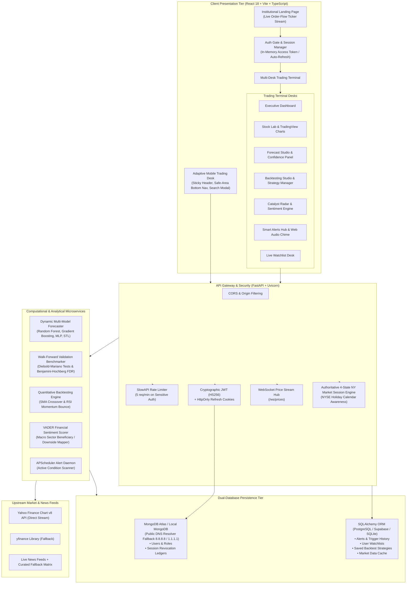

<div align="center">
  <a href="https://github.com/Harsh-Jain-10/StockVisionPro">
    
  </a>

  <br /><br />

  [](https://reactjs.org/)
  [](https://www.typescriptlang.org/)
  [](https://vitejs.dev/)
  [](https://fastapi.tiangolo.com/)
  [](https://www.python.org/)
  [](https://www.mongodb.com/atlas)
  [](https://www.sqlalchemy.org/)
  [](https://scikit-learn.org/)
  [](https://jwt.io/)
  [](https://docs.pytest.org/)
  [](LICENSE)

  <br />

  <h3>Institutional Quantitative Intelligence, Machine Learning Forecasts & Algorithmic Strategy Laboratory</h3>

  <p align="center">
    <a href="#-system-architecture">Architecture</a> •
    <a href="#-core-capabilities--features">Core Features</a> •
    <a href="#-walk-forward-validation--honest-model-confidence">Honest Quant Benchmark</a> •
    <a href="#-algorithmic-backtesting-studio">Backtesting Studio</a> •
    <a href="#-getting-started">Installation</a> •
    <a href="#-api-directory--endpoints">API Reference</a> •
    <a href="#-cloud-deployment">Cloud Deployment</a>
  </p>
</div>

---

## 📌 Executive Overview

**StockVision Pro** is an institutional-grade, full-stack quantitative market analytics and predictive intelligence terminal engineered for retail traders, quantitative researchers, and equity analysts. Combining high-throughput real-time market data ingestion with multi-model machine learning regressors, natural language catalyst discovery, automated strategy backtesting, and precision technical alert triggers, StockVision Pro provides uncompromising decision intelligence straight to your browser.

Unlike superficial financial dashboards that present black-box model claims with unrealistic precision, StockVision Pro features an **Honest Model Confidence Engine** backed by empirical out-of-sample walk-forward validation against naive random-walk persistence baselines ($\hat{P}_{t+1} = P_t$), rigorous Diebold-Mariano statistical significance testing, and Benjamini-Hochberg False Discovery Rate (FDR) control.

Equipped with an institutional landing page featuring dynamic live order-flow ticker animations, enterprise dual-database clustering (MongoDB Atlas + PostgreSQL / SQLite), user-scoped session encryption, and a 100% responsive desktop/mobile trading desk, StockVision Pro bridges the gap between retail tooling and institutional quant infrastructure.

---

## 🏗️ System Architecture

StockVision Pro is built on a modular, decoupled micro-architecture combining an ultra-responsive client-side Single Page Application (SPA), a high-concurrency asynchronous API Gateway, analytical computational microservices, and a dual-database persistence tier.



---

## 🔮 Walk-Forward Validation & Honest Quant Methodology

Most retail machine learning tools make unscientific accuracy claims (e.g. *"95% directional accuracy"*). StockVision Pro is built on **methodological honesty and academic rigor**:

```mermaid
flowchart LR
    A["Raw Historical OHLCV Bars<br/>(1y - 2y Daily Series)"] --> B["Log-Return Regressor<br/>y_t = ln(P_t+1 / P_t)"]
    B --> C["14-Feature Dynamic Indicator Matrix<br/>(RSI, MACD, Bollinger Bands, ATR, Lags)"]
    C --> D["Expanding-Window Walk-Forward Split<br/>(Initial 50% Train, Sequential 20-Day Folds)"]
    D --> E["Competitive Model Tournament<br/>(RF, Gradient Boosting, MLP, STL)"]
    E --> F["Benchmark vs. Naive Persistence<br/>P_hat_t+1 = P_t (Random Walk Baseline)"]
    F --> G["Diebold-Mariano Test<br/>(Newey-West HAC Variance Estimator, 5 Lags)"]
    G --> H["Benjamini-Hochberg FDR Control<br/>(False Discovery Rate alpha = 0.05)"]
    H --> I["Honest Model Confidence Panel<br/>(Skill Score %, FDR Status, Plain-Language Disclosures)"]
```



### Key Statistical Disclosures:
- **Target Variable**: 1-Day forward logarithmic return $y_t = \ln\left(\frac{P_{t+1}}{P_t}\right)$ rather than raw nominal price series, preventing decision tree extrapolation ceilings and ensuring statistical stationarity.
- **Skill Score**: Evaluated strictly as:
  $$\text{Skill Score} = \left(1 - \frac{\text{MAPE}_{\text{model}}}{\text{MAPE}_{\text{naive}}}\right) \times 100$$
  A positive Skill Score indicates genuine predictive advantage over naive persistence; a negative or zero score discloses that the model does not beat random walk persistence.
- **Statistical Significance**: Uses the **Diebold-Mariano** differential loss test $d_t = |e_t^{\text{naive}}| - |e_t^{\text{model}}|$ with a 5-lag Newey-West Heteroskedasticity and Autocorrelation Consistent (HAC) variance estimator.
- **Multiple Hypothesis Testing Correction**: Controls family-wise error rates across the 36-ticker universe using the **Benjamini-Hochberg FDR** procedure ($\alpha = 0.05$).

---

## ✨ Core Capabilities & Features

### 1. 🌟 Institutional Landing Page & Authentication Showcase
* **Live Order-Flow Ticker Stream**: Animated real-time ticker strip showcasing major symbols (`NVDA`, `AAPL`, `BTC`, `SPY`, `TSLA`, `MSFT`, `AMZN`, `META`, `GOOGL`, `ETH`) with simulated order-book price micro-fluctuations.
* **Dual-Mode Authentication Desk**: Seamless single-page tab switcher between *"Sign In"* and *"Create Account"* with real-time password criteria validation (alphanumeric, 8+ characters minimum).
* **Live Database Health Monitor**: Instant visual heartbeat displaying real-time MongoDB Atlas cluster connectivity, latency, and active collections.
* **Frictionless Entry**: Direct guest exploration mode or instant authenticated profile hydration.

### 2. 🔐 Enterprise Authentication & Session Security
* **Dual-Database Architecture**: Primary user credential and token storage on MongoDB Atlas with automated fallback to SQLite/PostgreSQL for offline environments.
* **Resilient Public DNS Fallback**: Custom Google (`8.8.8.8`) and Cloudflare (`1.1.1.1`) DNS resolver fallback ensuring reliable MongoDB Atlas SRV connection strings in restricted corporate networks.
* **XSS-Immune In-Memory JWT Access Tokens**: Cryptographically signed access tokens (HS256, 30-minute expiration) kept strictly in-memory.
* **HttpOnly Secure Refresh Rotation**: 7-day refresh token stored in secure `HttpOnly`, `SameSite=Lax` cookies with an automated Axios 401 interceptor that silently renews credentials without interrupting user workflows.
* **Brute-Force Rate Limiting**: SlowAPI protection (5 requests per minute) on sensitive authentication routes (`/api/auth/login`, `/api/auth/register`).
* **Bcrypt Password Encryption**: Industry-standard cryptographic salted password hashing.

### 3. 📈 Quantitative Backtesting Studio (`/backtest`)
* **Algorithmic Strategy Simulation**:
  - **SMA Crossover**: Fast/Slow moving average cross strategy with customizable short (e.g. 20) and long (e.g. 50) windows.
  - **RSI Momentum Bounce**: Oversold buy and overbought sell strategy with customizable period (14), oversold threshold (30), and overbought target (70).
* **Multi-Horizon Historical Evaluation**: Test across `6m`, `1y`, `2y`, `5y`, and `max` trading bars.
* **Institutional Performance KPIs**:
  - Strategy Total Return (%) vs. Benchmark Buy & Hold Return (%)
  - Maximum Drawdown (MDD %)
  - Win Rate (%) & Profit Factor
  - Annualized Sharpe Ratio
  - Total Executed Trades Counter
* **Interactive Equity Curves**: Visual dual-series performance chart tracking strategy equity growth vs buy-and-hold benchmark.
* **Detailed Trade Log**: Chronological trade execution ledger with entry date, exit date, trade type, entry/exit prices, and percentage P&L.
* **"My Strategies" Saved Backtest Desk**: Save profitable configurations under your user account, inspect historical metrics, and trigger **1-Click Rerun** (`/api/saved-backtests/{id}/rerun`) to re-execute against the freshest live market data.

### 4. 🎯 Honest Model Confidence Panel
* **Empirical Validation Universe**: 36 liquid equities (20 US blue chips + 16 Indian NSE large caps) evaluated over 2 years of daily data across expanding-window walk-forward folds.
* **Transparent Skill Score Display**: Highlights the real out-of-sample edge against persistence.
* **Diebold-Mariano Statistical Disclosure**: Displays exact test statistics, p-values, and FDR significance badges (`Statistically Significant Edge` vs `No Validated Edge`).
* **Plain-Language Risk Disclosures**: Clear, honest warnings clarifying whether algorithmic signals exhibit statistical confidence or if market efficiency dominates.

### 5. 🔮 Forecast Studio & Multi-Model Regressor
* **Dynamic Auto-Model Selection**: Trains 4 machine learning algorithms on an 80/20 train/validation split:
  - Random Forest Regressor
  - Gradient Boosting Regressor
  - Multi-Layer Perceptron (MLP) Neural Network
  - Seasonal-Trend Decomposition (STL / Fourier Trend)
* **Log-Return Target Formulation**: Overcomes tree extrapolation ceilings by forecasting $\ln(P_{t+1}/P_t)$ before recursive price reconstruction.
* **14-Feature Dynamic Indicator Matrix**: Feeds RSI(14), MACD histogram, Bollinger Band width, ATR volatility lags, and rolling momentum directly into model inputs.
* **Multiplicative Log-Normal Confidence Corridors**: Dynamically generates expanding probabilistic price envelope bounds for horizons from 7 to 90 days.
* **Forecast Opportunities Scanner**: Automatically scans the 36-ticker equity universe to rank under/overvalued stocks based on algorithmic upside targets.
* **Forecast Accuracy Ledger**: Persistent database tracking comparing historical predictions against actual realized market prices.

### 6. 📊 Interactive Stock Lab & Charting Desk
* **TradingView Lightweight Charts**: Smooth canvas-based time-series OHLC candlestick visualization.
* **Automated Candlestick Pattern Recognition**: Automatically annotates Doji, Hammer, Shooting Star, Bullish Engulfing, and Bearish Engulfing patterns on active charts.
* **Dynamic Indicator Overlays**: Toggle RSI(14), MACD(12, 26, 9), Bollinger Bands(20, 2), and Simple Moving Averages (20, 50, 200).
* **Multi-Ticker Comparison Lab**: Normalizes and compares relative percentage performance across multiple symbols on a single unified canvas (e.g. `NVDA` vs `MSFT` vs `AAPL`).
* **AI Analyst Summaries**: Context-aware natural language teardown breaking down technical setups, support/resistance levels, scenario price bands, and key risk factors.

### 7. 📰 Global Catalyst Radar & News Sentiment Engine
* **Top 20 Daily Market News Feed**: High-impact headlines scored via VADER sentiment intensity analysis (compound polarity, bullish/neutral/bearish classifications).
* **5 Macro Sectors**: Tech & AI Infrastructure, Monetary Policy & Rates, Geopolitics & Global Trade, Energy & Commodities, Corporate Strategy & Earnings.
* **Automated Beneficiary & Downside Risk Mapping**: Surfaces top projected upside gainers (`+4.2%`) and downside vulnerable assets (`-3.1%`) with direct deep-links to the Stock Lab.
* **Resilient Multi-Source Fallback**: Includes 20 curated multi-sector catalysts guaranteeing zero empty screens during upstream rate limits.

### 8. 🔔 Smart Price & Technical Alerts Hub
* **5 Strategy Condition Types**:
  - 🚀 **Price Above (Breakout)**: Alerts when price crosses through resistance.
  - 🛡️ **Price Below (Dip / Stop-Loss)**: Alerts when price drops to key buy support or protection stops.
  - ⚡ **Golden Cross (50/200 SMA)**: Alerts on major moving average trend confirmations.
  - 🟢 **RSI Oversold (< 30)**: Alerts on severe selling exhaustion setups.
  - 🔴 **RSI Overbought (> 70)**: Alerts on extended momentum take-profit zones.
* **1-Click Dynamic Presets**: Pre-calculated buttons (`+2% Bounce`, `+5% Breakout`, `+10% Surge`, `-3% Dip Buy`, `-5% Stop Loss`).
* **Live Proximity Indicator**: Displays exact price delta and percentage distance from market price.
* **Web Audio Synthesizer Chime**: Integrated dual-tone audio chime (D5 → A5) with instant preview and mute toggle.
* **Background Worker Scheduler**: APScheduler daemon evaluating live quotes against active alerts every 30 seconds.
* **In-App Notification Polling**: `/api/alerts/triggered` polling delivering real-time desktop/mobile toast alerts.

### 9. 📋 User-Scoped Watchlist Desk
* **Personalized Ticker Lists**: Add and track favorite symbols under your user account.
* **Real-Time Data Feeds**: Live pricing, 24-hour percentage change, market capitalization, and daily trading volume.
* **1-Click Add Everywhere**: Add stocks directly to your watchlist from the Search Modal, Stock Lab, Forecast Studio, or Catalyst Radar.

### 10. 🕒 Authoritative 4-State NY Market Session Engine
* **Authoritative Server Time Calculation**: Evaluates US market states strictly in the `America/New_York` timezone.
* **Full NYSE Holiday Calendar Awareness**: Automatically accounts for New Year's Day, MLK Day, Washington's Birthday, Good Friday, Memorial Day, Juneteenth, Independence Day, Labor Day, Thanksgiving, and Christmas.
* **4 Precise Market States**:
  - 🟡 **Pre-Market**: 04:00 – 09:30 ET
  - 🟢 **Regular Trading**: 09:30 – 16:00 ET
  - 🟣 **After-Hours**: 16:00 – 20:00 ET
  - ⚪ **Closed / Weekend**: 20:00 – 04:00 ET & Weekends/Holidays
* **Real-Time Countdown**: Live countdown timer to the next market transition with an animated heartbeat status indicator.

### 11. 📱 Responsive Mobile & Tablet Trading Desk
* **Sticky Mobile Header (56px)**: Live market session indicator, brand identity, and instant search modal trigger.
* **Fixed Safe-Area Bottom Navigation (68px)**: Native iOS/Android safe area support with quick access to Dashboard, Stock Lab, Forecast Studio, Backtesting, and Watchlist.
* **Full-Screen Search Modal**: Autocomplete symbol search with trending market tickers and local search history.
* **Compact Floating AI Assistant (48px)**: Floating launcher with online indicator and natural language financial Q&A.

---

## 🛠️ Technology Stack

| Layer | Technologies & Libraries |
| :--- | :--- |
| **Frontend Framework** | React 18.3, TypeScript 5.9, Vite 7.2 |
| **State & Server Cache** | TanStack React Query v5, Zustand v5 |
| **Styling & Motion** | Vanilla CSS Design Tokens (Dark/Light Modes), Framer Motion 12, Lucide React Icons |
| **Financial Charting** | TradingView Lightweight Charts v4, Recharts v3 |
| **Audio Notification** | HTML5 Web Audio API Synthesizer (Zero asset download latency) |
| **Backend Framework** | FastAPI 0.115, Uvicorn 0.34, Python 3.11+ |
| **Security & Auth** | PyJWT 2.10, Passlib 1.7, Bcrypt 4.0, SlowAPI 0.1.10 (Rate Limiter) |
| **Primary Auth Database** | MongoDB Atlas (PyMongo 4.10) with custom public DNS resolver fallback (`dnspython`) |
| **Analytics SQL Database** | SQLAlchemy 2.0 (PostgreSQL / Supabase / SQLite) |
| **Machine Learning** | Scikit-Learn 1.6 (RandomForest, GradientBoosting, MLPRegressor), NumPy 2.2, Pandas 2.2 |
| **Technical Analysis** | `ta` 0.11 (Technical Analysis Library in Python) |
| **Sentiment Analysis** | `vaderSentiment` 3.3 (Financial headline intensity analysis) |
| **Market Data Ingestion** | Direct Yahoo Finance Chart v8 REST API + `yfinance` 0.2.54 fallback |
| **Background Scheduler** | APScheduler 3.11 (Asynchronous Alert Evaluation Loop) |
| **Deployment & Containers** | Docker, Docker Compose, Railway (`railway.json`), Vercel (`vercel.json`, `@vercel/analytics`) |

---

## 📁 Repository Structure

```text
StockVisionPro/
├── .env.example                     # Root environment configuration template
├── .gitignore                       # Git exclusions (credentials, databases, caches)
├── docker-compose.yml               # Multi-container orchestration (Backend + Frontend)
├── banner_v2.svg                    # Vector animated graphic banner
├── LICENSE                          # MIT License
├── README.md                        # Master repository documentation
├── CHANGES.md                       # Comprehensive changelog of product features
├── AUDIT.md                         # Technical audit of ML, leakage, & backtesting
├── WALK_FORWARD_RESULTS.md          # 36-ticker walk-forward validation empirical report
│
├── backend/
│   ├── Dockerfile                   # Python 3.11-slim production container
│   ├── railway.json                 # Railway cloud deployment specification
│   ├── requirements.txt             # Pinned Python package dependencies
│   ├── main.py                      # FastAPI app, WebSocket order hub, alert worker, healthcheck
│   │
│   ├── data/
│   │   └── walk_forward_results.json # Pre-computed 36-ticker walk-forward benchmark database
│   │
│   ├── models/
│   │   ├── database.py              # SQLAlchemy models (User, RefreshToken, Watchlist, Alert, Backtest)
│   │   └── schemas.py               # Pydantic schemas (Auth, Market, Forecast, Backtest, Technicals)
│   │
│   ├── routers/
│   │   ├── auth.py                  # Register, login, refresh, logout, /me, rate limiting
│   │   ├── stock.py                 # Real-time quotes, historical OHLCV, indicator routes
│   │   ├── market.py                # Authoritative 4-state session status, overview, screeners
│   │   ├── watchlist.py             # User-scoped multi-symbol watchlist CRUD
│   │   ├── alerts.py                # User alert management & /api/alerts/triggered polling
│   │   ├── backtest.py              # Quantitative SMA Crossover & RSI strategy simulation
│   │   ├── saved_backtests.py       # "My Strategies" saved backtest management & 1-click rerun
│   │   ├── forecast.py              # Multi-model ML forecasting & walk-forward confidence routes
│   │   ├── compare.py               # Multi-ticker relative performance comparison
│   │   └── ai.py                    # Contextual market analysis & AI Assistant endpoints
│   │
│   ├── services/
│   │   ├── mongodb_service.py       # MongoDB Atlas connection manager with public DNS fallback
│   │   ├── data_service.py          # Yahoo Chart v8 ingestion, SQLite caching, live bar injection
│   │   ├── forecasting_service.py   # Multi-model training, log-return regression, recursive bounds
│   │   ├── analysis_service.py      # VADER sentiment engine, macro synthesis, AI summaries
│   │   ├── technical_service.py     # RSI, MACD, Bollinger Bands, SMA, pattern recognition
│   │   └── stock_universe.py        # Universe symbols & metadata definitions
│   │
│   └── tests/
│       ├── test_extended_features.py # Automated pytest suite (Auth, Watchlists, Alerts, Backtests)
│       └── test_market_status.py     # Automated pytest suite (4 sessions, NYSE holidays, timezones)
│
└── frontend/
    ├── Dockerfile                   # Production multi-stage Nginx container
    ├── nginx.conf                   # Nginx reverse proxy & SPA history fallback
    ├── vercel.json                  # Vercel SPA routing rewrites & security headers
    ├── package.json                 # Node dependencies & build scripts
    ├── vite.config.ts               # Vite bundler configuration
    ├── tsconfig.json                # TypeScript compiler configuration
    ├── index.html                   # HTML5 application shell
    │
    └── src/
        ├── api/
        │   └── client.ts            # Axios SDK with in-memory token state & 401 auto-refresh queue
        │
        ├── components/
        │   ├── LandingPage.tsx       # Institutional showcase with live moving ticker animations
        │   ├── AuthModal.tsx         # Sign In / Create Account modal with real-time criteria checks
        │   ├── BacktestingStudio.tsx # Quantitative backtesting desk, KPI cards & "My Strategies"
        │   ├── ForecastStudio.tsx    # Multi-model forecasting studio & Honest Confidence Panel
        │   ├── ForecastOpportunities.tsx # Undervalued algorithmic opportunities universe scanner
        │   ├── ForecastAccuracy.tsx  # Historical prediction verification ledger
        │   ├── MobileHeader.tsx      # Responsive sticky 56px top bar with session status pill
        │   ├── MobileBottomNav.tsx   # Fixed 68px safe-area bottom navigation bar
        │   └── MobileSearchModal.tsx # Fullscreen autocomplete search with history
        │
        ├── data/
        │   └── newsSentimentFallback.ts # 20 curated multi-sector fallback market catalysts
        │
        ├── styles/
        │   ├── globals.css          # Design tokens, dark/light themes, animations, glassmorphism
        │   └── landing.css          # Institutional landing page & ticker marquee styling
        │
        ├── utils/
        │   └── marketStatus.ts      # Authoritative NYSE session tracking, timers & heartbeat
        │
        └── main.tsx                 # App bootstrapping, view routing, Stock Lab, Alerts, Watchlist
```

---

## ⚡ API Directory & Endpoints

| Category | Method | Endpoint | Description | Auth Required |
| :--- | :---: | :--- | :--- | :---: |
| **Authentication** | `POST` | `/api/auth/register` | Create a new user account (Password validation & Bcrypt hash) | No |
| | `POST` | `/api/auth/login` | Authenticate user, issue in-memory JWT & HttpOnly refresh cookie | No |
| | `POST` | `/api/auth/refresh` | Renew expired JWT access token using HttpOnly cookie | Cookie |
| | `POST` | `/api/auth/logout` | Revoke active refresh token and clear cookies | Cookie |
| | `GET` | `/api/auth/me` | Fetch active user profile and permissions | **Yes** |
| | `GET` | `/api/auth/database-status` | Inspect MongoDB Atlas cluster connectivity & latency | No |
| **Market Status** | `GET` | `/api/market/status` | Authoritative 4-state session status, NYSE holiday & countdown | No |
| | `GET` | `/api/market/overview` | Major index quotes (S&P 500, Nasdaq, Dow, Russell) | No |
| | `GET` | `/api/market/news-sentiment` | Top 20 daily catalysts, sentiment score, beneficiaries & risks | No |
| | `POST` | `/api/market/screener` | Multi-criteria technical screener | No |
| | `POST` | `/api/market/ai-screener` | Natural language market screening query | No |
| **Stocks & Quotes** | `GET` | `/api/stocks/{symbol}/quote` | Real-time quote, intraday change, volume, high/low | No |
| | `GET` | `/api/stocks/{symbol}/history` | Historical OHLCV bars (`1d`, `1w`, `1m`, `1y`, `2y`, `5y`) | No |
| | `GET` | `/api/stocks/{symbol}/technicals` | Computed indicators (RSI, MACD, Bollinger Bands, SMA) | No |
| | `GET` | `/api/stocks/{symbol}/signals` | Real-time candlestick pattern recognition signals | No |
| | `GET` | `/api/stocks/search?q={query}` | Search equity symbols with autocomplete | No |
| **Forecasting** | `POST` | `/api/forecast/run` | Execute dynamic multi-model ML forecast on target symbol | No |
| | `GET` | `/api/forecast/{symbol}/confidence` | Honest Model Confidence & Walk-Forward benchmark statistics | No |
| | `GET` | `/api/forecast/opportunities` | Universe scan for undervalued algorithmic opportunities | No |
| | `GET` | `/api/forecast/accuracy` | Historical model prediction verification ledger | No |
| **Backtesting** | `POST` | `/api/backtest/run` | Simulate algorithmic strategy (SMA Crossover / RSI) | No |
| | `GET` | `/api/saved-backtests` | List user's saved strategy backtests | **Yes** |
| | `POST` | `/api/saved-backtests` | Save a strategy backtest configuration and performance metrics | **Yes** |
| | `DELETE` | `/api/saved-backtests/{id}` | Delete a saved backtest | **Yes** |
| | `POST` | `/api/saved-backtests/{id}/rerun` | 1-Click re-run saved strategy against fresh live market data | **Yes** |
| **Watchlist** | `GET` | `/api/watchlist` | Retrieve user's watchlist with live quotes | **Yes** |
| | `POST` | `/api/watchlist` | Add a stock symbol to user's watchlist | **Yes** |
| | `DELETE` | `/api/watchlist/{symbol}` | Remove a stock symbol from user's watchlist | **Yes** |
| **Alerts Hub** | `GET` | `/api/alerts` | List all active armed price & technical alerts | **Yes** |
| | `POST` | `/api/alerts` | Create an alert (Breakout, Dip, Golden Cross, RSI) | **Yes** |
| | `DELETE` | `/api/alerts/{id}` | Delete an alert | **Yes** |
| | `GET` | `/api/alerts/triggered` | Poll newly triggered alerts for in-app toast notifications | **Yes** |
| **AI Assistant** | `GET` | `/api/ai/stocks/{symbol}/summary` | AI Analyst breakdown of active technicals & risk factors | No |
| | `POST` | `/api/ai/assistant` | Context-aware natural language market Q&A dialog | No |
| **System** | `GET` | `/health` | Healthcheck endpoint reporting SQL DB & MongoDB Atlas status | No |
| | `WS` | `/ws/prices` | WebSocket live order-flow streaming prices | No |

---

## 🚀 Getting Started

### Option 1: Docker Compose (Fastest & Zero Setup)

Ensure [Docker Desktop](https://www.docker.com/products/docker-desktop/) is running, then run from the repository root:

```bash
docker-compose up --build
```

Access the application:
* 🌐 **Web Interface:** `http://localhost:80` (or `http://localhost:5173` in dev mode)
* 📄 **FastAPI Interactive Swagger Docs:** `http://localhost:8000/docs`
* 🩺 **Health Check:** `http://localhost:8000/health`

---

### Option 2: Local Development Setup

#### 1. Backend Setup (Terminal 1)

Ensure you have **Python 3.10+** (Python 3.11 recommended) installed:

```powershell
# Navigate to backend
cd backend

# Create virtual environment
python -m venv venv

# Activate virtual environment
# On Windows (PowerShell):
.\venv\Scripts\activate
# On macOS / Linux:
# source venv/bin/activate

# Install dependencies
pip install -r requirements.txt
```

Create a `.env` configuration file in the `backend/` directory:

```env
# Optional AI / LLM API Keys
GROQ_API_KEY=your_groq_api_key_here
GEMINI_API_KEY=your_gemini_api_key_here
OPENAI_API_KEY=your_openai_key_here
NEWSAPI_KEY=your_newsapi_key_here

# App Configuration
ENV=development
CORS_ORIGIN=http://localhost:5173,http://127.0.0.1:5173

# Databases
DATABASE_URL=sqlite:///./stockvision.db
MONGODB_URI=mongodb+srv://<username>:<password>@<cluster>.mongodb.net/stockvision?retryWrites=true&w=majority

# Authentication & Session Security
JWT_SECRET_KEY=generate_a_secure_random_key_with_openssl_rand_hex_32
JWT_ALGORITHM=HS256
ACCESS_TOKEN_EXPIRE_MINUTES=30
REFRESH_TOKEN_EXPIRE_DAYS=7

# Scheduler & Engine
ML_RETRAIN_INTERVAL_HOURS=24
PRICE_REFRESH_SECONDS=10
```

> [!NOTE]
> If `MONGODB_URI` is omitted, the application runs user management via SQLite fallback tables.

Launch the FastAPI backend server:

```powershell
python -m uvicorn main:app --reload --host 127.0.0.1 --port 8000
```

---

#### 2. Frontend Setup (Terminal 2)

Ensure you have **Node.js 18+** installed:

```powershell
# Navigate to frontend
cd frontend

# Install dependencies
npm install
```

Verify or create `frontend/.env.local`:

```env
VITE_API_URL=http://127.0.0.1:8000/api
```

Start the Vite development server:

```powershell
npm run dev
```

Open your browser at **`http://127.0.0.1:5173`**.

---

## 🧪 Testing & Quality Assurance

StockVision Pro includes comprehensive unit and integration test suites:

```powershell
# Run the complete backend test suite
cd backend
python -m pytest tests -v
```

**Test Coverage Highlights:**
* ✅ `test_extended_features.py`: Password validation rules, user registration/login, silent refresh token revocation, user-scoped watchlists, saved backtest creation & 1-click rerun, and honest model confidence payloads.
* ✅ `test_market_status.py`: Authoritative 4-state session transitions (Pre-market, Regular, After-hours, Closed), NYSE holiday awareness, weekend handling, and timezone localization.

---

## ☁️ Cloud Deployment

StockVision Pro is optimized for modern cloud container platforms:

### 1. Frontend (Vercel)
* Connect your GitHub repository to [Vercel](https://vercel.com/).
* Set **Root Directory** to `frontend`.
* Add environment variable:
  ```env
  VITE_API_URL=https://your-backend-railway-app.railway.app/api
  ```
* Vercel will automatically configure single-page application routing via `vercel.json` and enable `@vercel/analytics`.

### 2. Backend (Railway / Render / Docker)
* Deploy directly using the provided `backend/Dockerfile` and `backend/railway.json`.
* Set health check path to `/health`.
* Configure production environment variables (`MONGODB_URI`, `DATABASE_URL`, `JWT_SECRET_KEY`, `CORS_ORIGIN`).

### 3. Database (MongoDB Atlas + PostgreSQL / Supabase)
* **MongoDB Atlas**: Free M0 cluster or higher for primary user credentials and session tokens.
* **PostgreSQL / Supabase**: High-performance relational database for market caches, watchlists, saved backtests, and alerts.

---

## 👨‍💻 Author & Contributions

Built with precision by **Harsh Jain**  
*Full-Stack Engineer & Quantitative Systems Architect*  
* GitHub: [@Harsh-Jain-10](https://github.com/Harsh-Jain-10)
* Repository: [Harsh-Jain-10/StockVisionPro](https://github.com/Harsh-Jain-10/StockVisionPro)

Contributions, feature suggestions, and bug reports are warmly welcome! Please review [CONTRIBUTING.md](CONTRIBUTING.md) before submitting pull requests.

---

## ⚠️ Disclaimer

*StockVision Pro is an educational and analytical research platform built for informational purposes. Algorithmic forecasts, machine learning models, technical indicators, and backtest results do not constitute financial, investment, or trading advice. Past performance and simulated backtest gains do not guarantee future returns. Always consult a certified financial advisor and perform your own independent due diligence before committing capital to financial markets.*
